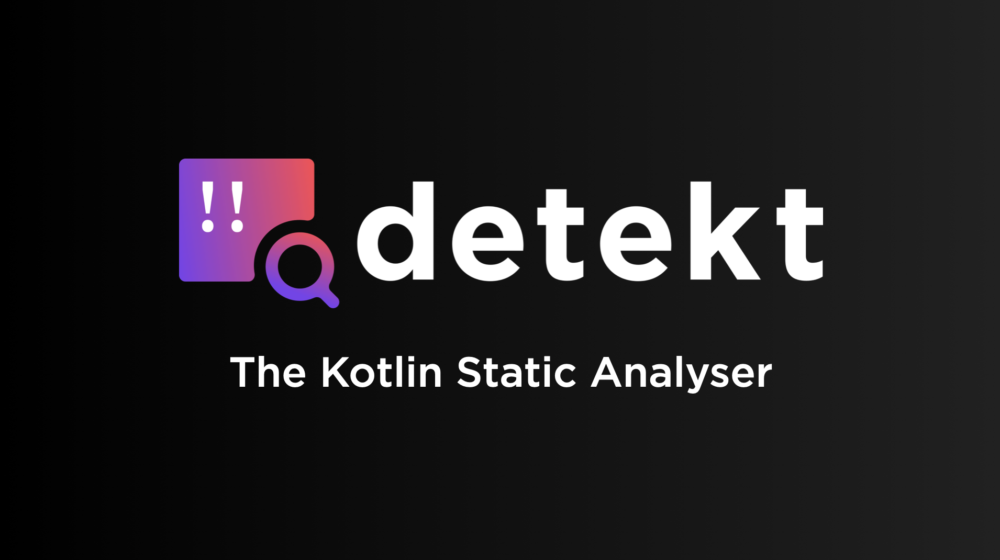
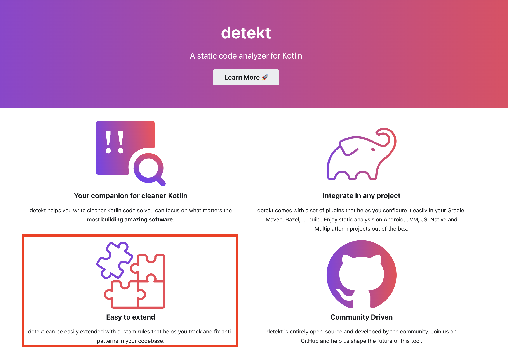
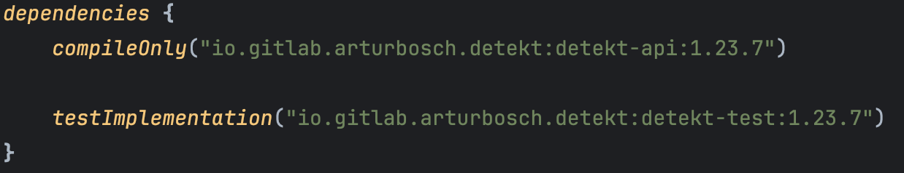
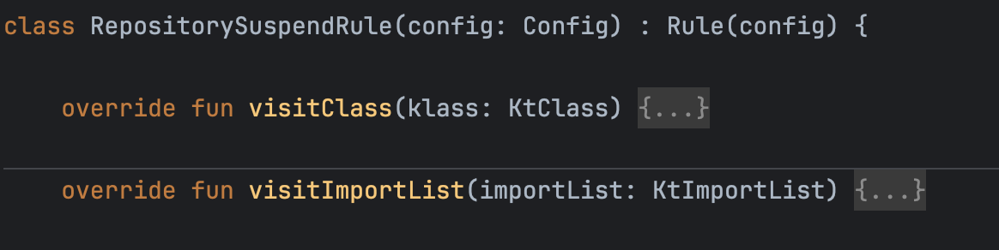
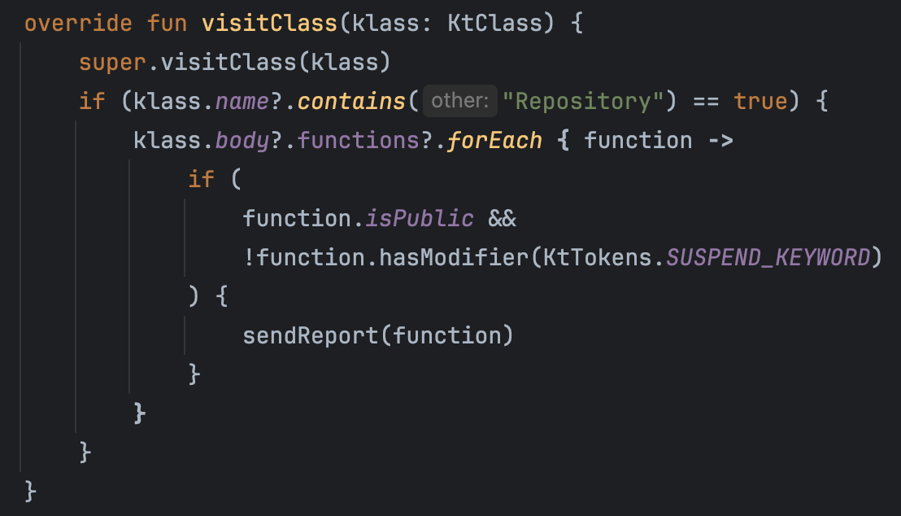
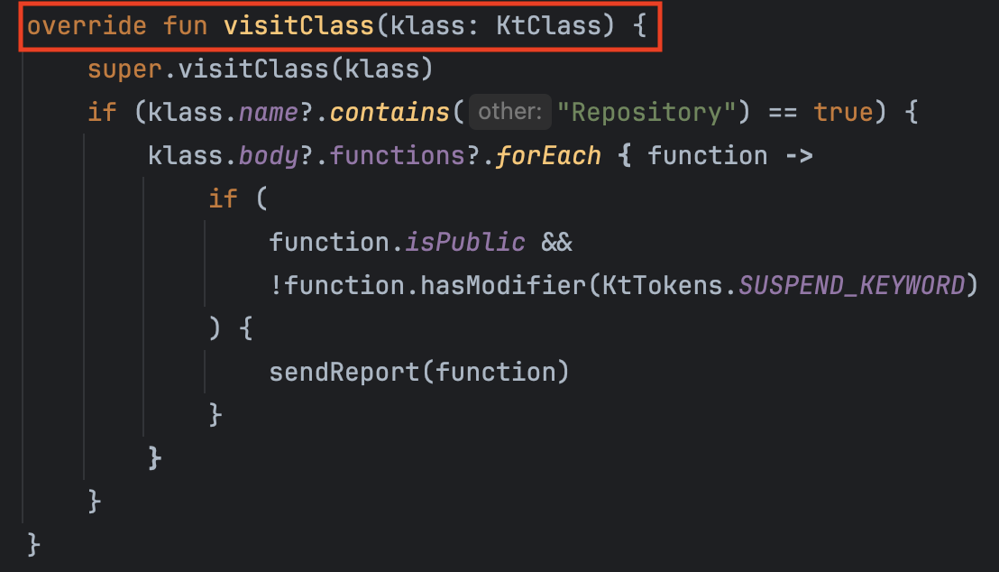
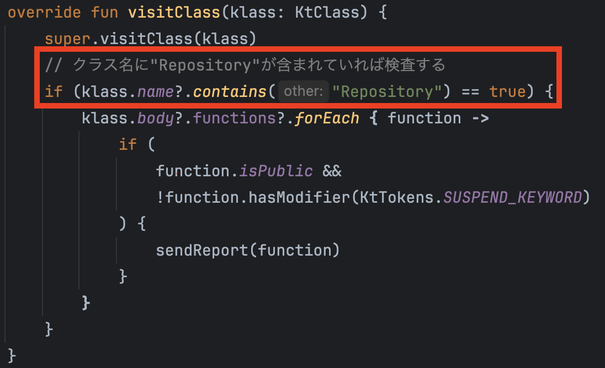
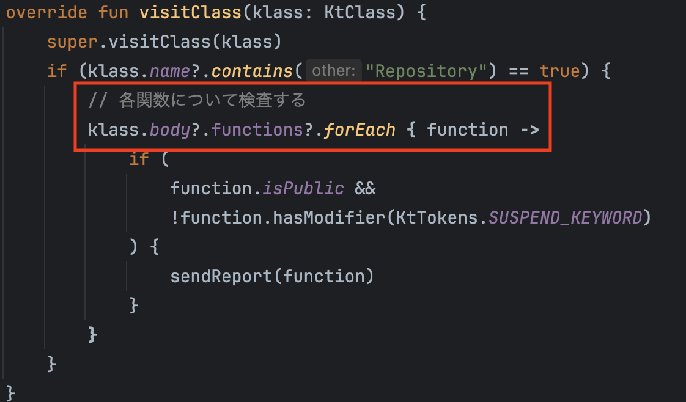
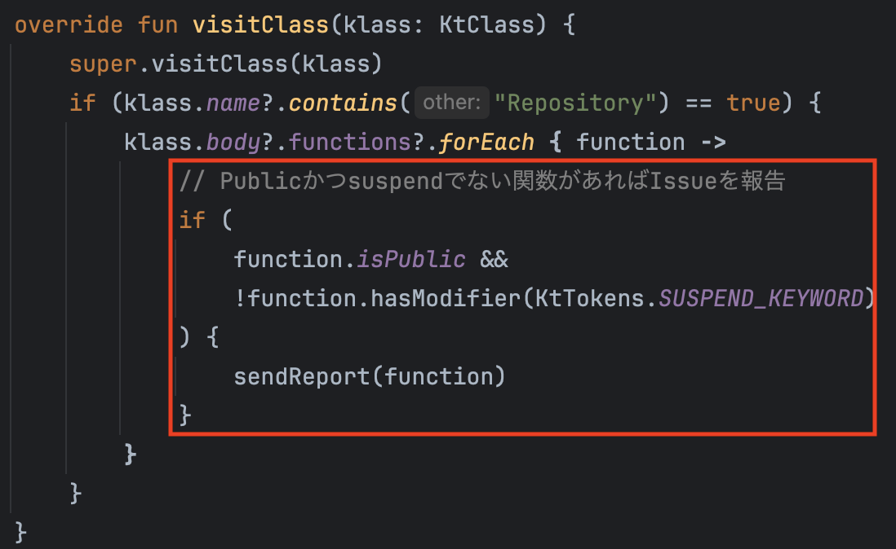
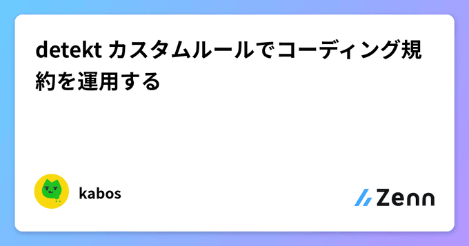

<!-- 
class: title
 -->

# detekt カスタムルールで コーディング規約を運用する

  
2024.11.8
DroidKaigi.collect { #13@Tokyo }
kabos(@chronotrg)

 

 

 

 

---

# About Me

- kabos(@chronotrg)
- Androidエンジニア_4年目
- Github: https://github.com/taratara10
- 好きなもの
    - Vim
    - KMP
    - WearOS

 

 

 

 

---

# 今回伝えたいこと

detektカスタムルールの存在を広めたい！

<!-- detektでカスタムルールを作ることは、コードレビューの手間を省き、生産性を上げる強力なツールとなります -->
<!-- 詳しい実装は記事を書いているので、このLTでぜひ興味をもって今後の選択肢として考慮してもらいたい -->

---

<!-- _class: single-message -->
 # コーディングルールを 守るのは難しい😔
<!-- 私がlinterでカスタムルールを作ろうと思ったモチベーションはこれが発端です -->

---
# 開発が進んできたプロジェクト😀
- コード量が増えてきた
- メンバー毎に書き方が違う
- 命名を揃えたい
- これ以上多様化するとメンテが大変になりそう
<!-- よくある話 -->
<!-- コードの複雑化に関する課題が出てきます -->

---
<!-- _class: single-message -->
<h1 style="font-size:70px"> コードに統一感を持たせたい💭 </h1>

<!-- というモチベーションが湧いてきます -->

---
<!-- _class: single-message -->
# コーディング規約を作るぞ💪

☺＜️これで解決。平和はもたらされた

<!-- という解決策をとりがちです。ルールを作れたので満足した気に慣れますね -->

---
# 6か月後🫨

- コーディング規約作ったけど、今は忙しいから後で対応しよう
- コードレビューの時間がない...
- 動くからとりあえずマージしてヨシ！👉
<!-- 時は流れて、開発は忙しくなり、目の前のタスクをこなすことが最優先になります-->
<!-- コーディング規約は頭の片隅にありますが、最優先事項ではありません-->

---
# 1年後😨

- 暫定対応のコードがコピペされて蔓延
- コーディング規約...そんなのもあったね...
- カオス！

---
<!-- _class: single-message -->
# こんなはずでは...🫠

---

# コーディング規約の運用を阻害する要因
- ルールが厳密に明文化されていない
- 長い文章を読んでも内容が理解しにくいし、覚えられない
- メンバーが変化して運用されなくなった
- etc...

<!-- ふわふわルールだとRevで指摘しても認識があわず、Revコストが大きくなる -->
<!-- メンバーの努力によって運用することは非常に難しく、継続させるのは困難です -->

---
<!-- _class: single-message -->
# 重要で大変なことは 自動化しよう✨
<!-- エンジニアの思考で-->

---
<!-- _class: single-message -->
<h1 style="font-size:68px">CIと連携しやすくて 
プロジェクトの独自ルールを作れる Linterさえあれば...🤔
</h1>
 
---
<!-- _class: code -->

---

# detekt

- Kotlin向けの静的コード解析ツール
- DroidKaigi/conference-app-2024でも採用
- 標準ルールセットが豊富で柔軟にカスタマイズできる

<!-- 標準ルールが豊富という印象が多いのではないでしょうか -->
---

---

<!-- _class: single-message -->
# Easy to Extend !

手軽にカスタムルールがつくれるよ！

<!-- カスタムしやすいというのがdetektの大きなメリットがあります -->
---
# カスタムルールを作ってみる

<h2 style="color: #FF5555;font-weight: bold;">「Repositoryが公開するメソッドはsuspendであること」

<!-- ここからはざっくりとしたカスタムルールのイメージを説明します -->
---
<!-- _class: code -->

---
<!-- _class: code -->
#### Repositoryが公開するメソッドはsuspendであること

<!-- visitXXXという解析のためのinterfaceが提供されます -->

---
<!-- _class: code -->
#### Repositoryが公開するメソッドはsuspendであること

---
<!-- _class: code -->
#### Repositoryが公開するメソッドはsuspendであること

---
<!-- _class: code -->
#### Repositoryが公開するメソッドはsuspendであること

---
<!-- _class: code -->
#### Repositoryが公開するメソッドはsuspendであること

---
<!-- _class: code -->
#### Repositoryが公開するメソッドはsuspendであること

<!--  -->

---
<!-- _class: single-message -->
# 直感的に書けそう！🚀

---

# 詳しい実装方法はこちら

https://zenn.dev/kabos/articles/d31c27cb473fba

 

---
<!-- _class: single-message -->
# detektカスタムルールで 生産性を爆上げしよう🚀

---
<!-- _class: single-message -->
<h1 style="font-size:70px"> ご清聴ありがとうございました！
